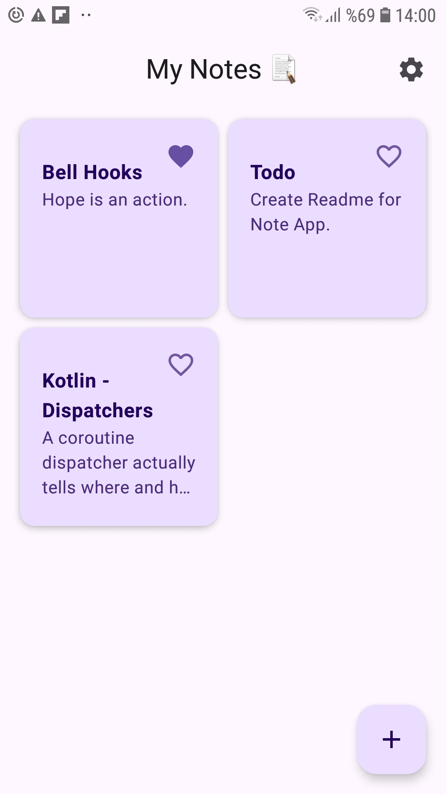
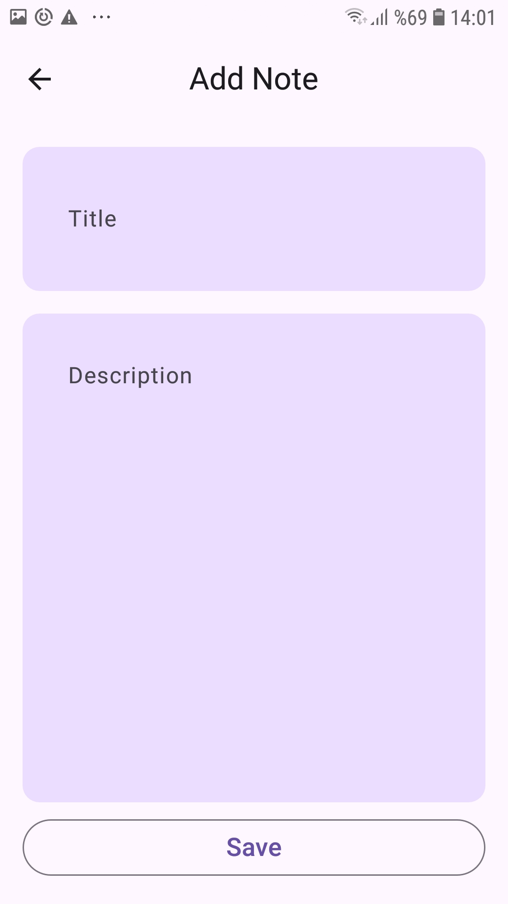
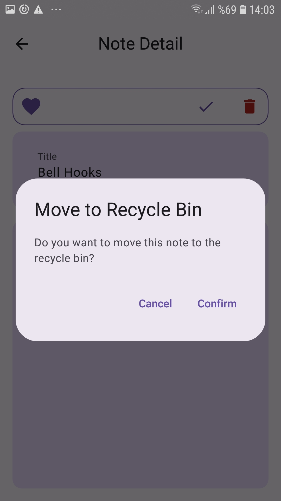
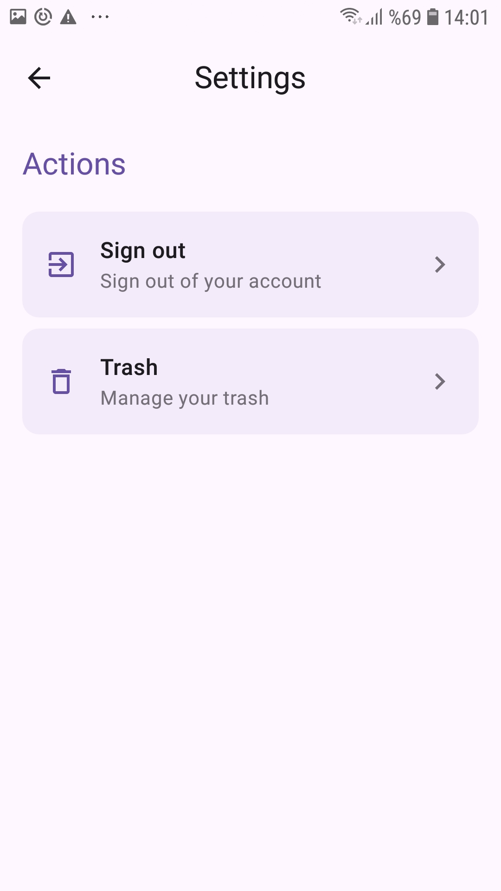
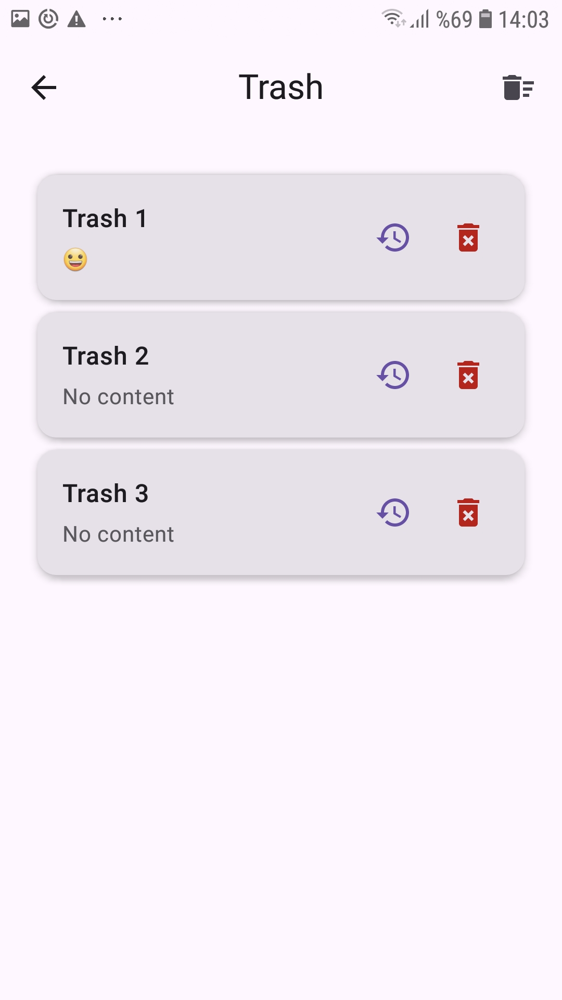

# Notes App

A modern Android note-taking application built with Jetpack Compose and Firebase. This app allows users to create, edit, delete, and manage their notes with features like favorites, trash management, and user authentication.

## Features

- ✨ **Modern UI** - Built with Jetpack Compose and Material Design 3
- 📝 **Note Management** - Create, edit, delete, and organize notes
- ⭐ **Favorites** - Mark important notes as favorites
- 🗑️ **Trash System** - Soft delete with restore functionality
- 🔐 **User Authentication** - Secure login/logout with Firebase Auth
- ☁️ **Cloud Sync** - Real-time synchronization across devices
- 📱 **Responsive Design** - Grid layout for optimal viewing experience
- 🎨 **Material Design** - Following Google's design guidelines

## Screenshots
<table>
  <tr>
    <td></td>
    <td></td>
    <td></td>
  </tr>
  <tr>
    <td></td>
    <td></td>
  </tr>
</table>

## Tech Stack

### Architecture & Design Patterns
- **MVVM (Model-View-ViewModel)** - Clean separation of concerns
- **Clean Architecture** - Organized code structure with use cases
- **Repository Pattern** - Data abstraction layer with interfaces
- **Dependency Injection** - Using Dagger Hilt

### UI Framework
- **Jetpack Compose** - Modern declarative UI toolkit
- **Material Design 3** - Google's latest design system
- **Compose Navigation** - Type-safe navigation between screens
- **Compose State Management** - StateFlow and Compose state handling

### Backend & Database
- **Firebase Realtime Database** - Cloud-hosted NoSQL database
- **Firebase Authentication** - User authentication and management
- **Repository Pattern Implementation** - Interface-based data layer abstraction
- **Real-time Synchronization** - Live data updates across devices

### Dependency Injection
- **Dagger Hilt** - Dependency injection framework for Android
- **ViewModel Injection** - Automated ViewModel creation and lifecycle management

### Architecture Components
- **Jetpack ViewModel** - UI-related data holder with lifecycle awareness
- **StateFlow** - Reactive state management
- **Coroutines** - Asynchronous programming and threading
- **Lifecycle-aware Components** - Automatic lifecycle management

### Development Tools & Libraries
- **Kotlin** - Primary programming language
- **Coroutines Flow** - Reactive programming with Flow and CallbackFlow
- **Compose Lifecycle** - Integration between Compose and Android lifecycle
- **Material Icons** - Comprehensive icon library
- **Interface Abstraction** - Repository interfaces for testability
## Key Implementation Details

### Authentication Flow
- Firebase Authentication integration with repository pattern
- Interface-based authentication abstraction (IFirebaseAuth)
- CallbackFlow implementation for reactive authentication
- Automatic user session management
- Secure login/logout functionality

### Data Management
- Real-time database listeners for live updates
- Optimistic UI updates for better user experience
- Soft delete implementation with restore capability

### State Management
- Reactive UI with StateFlow and Compose State
- Lifecycle-aware data observation
- Automatic UI updates on data changes

### Navigation
- Type-safe navigation with Compose Navigation
- Deep linking support for note details
- Proper back stack management
